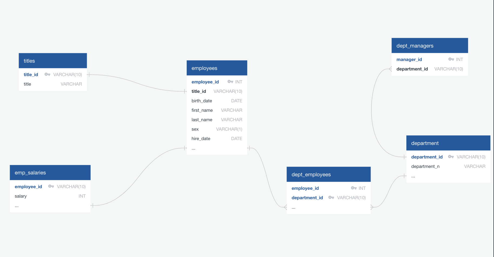

# sql-challenge

The goal of this exercise is to create a database that currently only exists in .csv files.

There were six .csv files containing employee information that were used to populate data into separate tables within PostGres. The resulting tables were:

1) employees - contains identifying employee information of those hired between 1980 and 1999
2) dept_employees - contains department information of each employee
3) department - contains department identifying information, specifically the department name and ID
4) titles - contains available employee roles within the company
5) dept_managers - identifies the managers of each department
6) emp_salaries - tracks the salaries of employees

To prepare the .csv files to be loaded, an entity relationship diagram (ERD) was created to help map out the relationships between the future tables and to help determine what items within the .csv files will serve as the primary keys, pandas was used to find duplicates in would-be primary keys. If there were duplicates in a column, this would indicate that it cannot be a primary key on its own and may need to be used in conjuction with another column to form a composite primary key. This was found to be the case with the dept_employees table, where both columns have to serve as the primary key due to employees being able to be associated with multiple departments. The SQL used to create the schemata within PostGres can be found in the file  employee_db_ERD_layout.sql. An image of the layout is below:

Once the ERD was completed by assigning columns and data types to each table, the .csv files were loaded into PostGres by way of pgAdmin to populate the created tables.

The tables were then queried using SQL for some exploratory analysis, such as pulling employee information of those who were hired in the 80s and who worked in what specified department. The queries used to explore the tables can be found in the employee_db_analysis.sql file.

